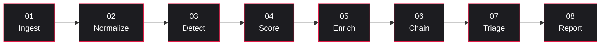
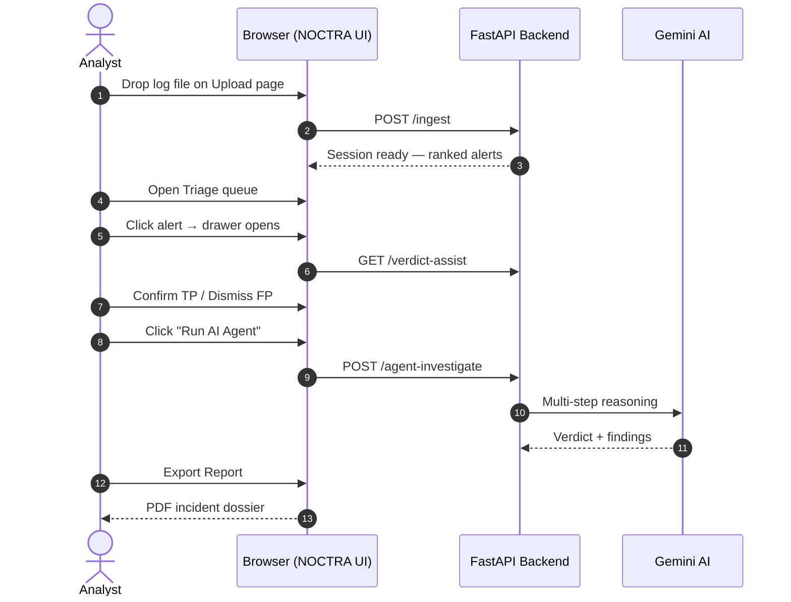
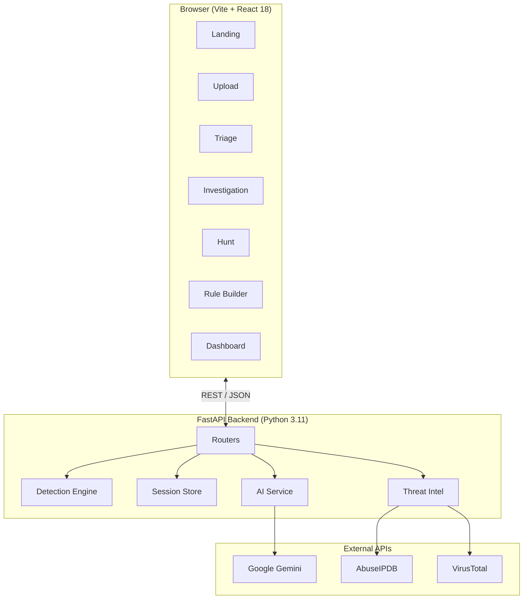

# NOCTRA AI — Autonomous SOC Platform

> **Drop a log file. Get ranked incidents, AI-explained verdicts, MITRE-mapped attack chains, and a forensic PDF report — in minutes.**

An AI-augmented Security Operations Center in a browser tab.  
**Storageless · MITRE ATT&CK-mapped · Explainable AI · L1/L2 dual-mode**

[](https://noctra-ai-autonomous-soc-platform.vercel.app)
[](https://vercel.com)
[](https://render.com)
[](LICENSE)

---

## Live Demo

**[noctra-ai-autonomous-soc-platform.vercel.app](https://noctra-ai-autonomous-soc-platform.vercel.app)**

No signup required. Drop a log file or click **"Run demo scenario"** to see a synthetic multi-stage attack.

---

## Table of Contents

1. [What is a SOC?](#1-what-is-a-soc-for-non-cyber-readers)
2. [What NOCTRA does](#2-what-noctra-does-in-one-paragraph)
3. [Why NOCTRA vs a normal SOC tool](#3-why-noctra-vs-a-normal-soc-tool)
4. [The 8-stage detection pipeline](#4-the-8-stage-detection-pipeline)
5. [Where AI is integrated](#5-where-ai-is-integrated-5-places)
6. [How the AI attack score is calculated](#6-how-the-ai-attack-score-is-calculated)
7. [Walkthrough: log file → PDF report](#7-walkthrough-log-file--pdf-report)
8. [Architecture](#8-architecture)
9. [Deployment](#9-deployment)
10. [Local Development](#10-local-development)
11. [Glossary](#11-glossary-for-newcomers)
12. [FAQ](#12-faq)

---

## 1. What is a SOC? (for non-cyber readers)

A **SOC** (Security Operations Center) is the team and software inside a company that watches everything happening on the network — login attempts, file transfers, DNS queries, app errors — and tries to spot the activity that looks like an **attacker** rather than a normal user.

> Think of a SOC like a hospital triage desk, but for cyber attacks. Most patients (events) walk in with a cold (noise). A few have something serious (an attack). The SOC's job is to figure out **which is which, fast, with limited people**.

| Tier | Role | Typical question |
|------|------|------------------|
| **L1 — Triage Analyst** | First responder. Decides if an alert is real (TP) or junk (FP). | *"Is this worth waking someone up?"* |
| **L2 — Threat Analyst** | Deep investigator. Reconstructs how an attacker moved. | *"What did they touch, and how did they get in?"* |

---

## 2. What NOCTRA does, in one paragraph

NOCTRA AI is a browser-based SOC that takes a raw log file (CSV / JSON / syslog / web access / EVTX), runs **25+ detection rules + a behavioral anomaly engine + an AI classifier** against it, and gives the analyst a **ranked queue of alerts with explanations**. The analyst clicks through, the AI suggests verdicts and explains its reasoning, the platform auto-correlates related alerts into **attack chains**, and a one-click **PDF incident report** lands at the end. Nothing is stored on disk — all data lives in RAM and is wiped when the session ends.

---

## 3. Why NOCTRA vs a normal SOC tool

| | Traditional SOC stack | **NOCTRA AI** |
|---|---|---|
| **Deployment** | Days to weeks — clusters, licenses, ingestion pipelines | **Browser tab. No install.** |
| **Cost per investigation** | $$ per GB ingested | **Free per session** |
| **AI scoring** | Usually a black-box "risk score" | **0–100 TP probability with the actual signals that produced it** |
| **Why this score?** | Rarely shown | **Click any score → list of weighted signals** |
| **MITRE ATT&CK mapping** | Add-on / paid module | **Built-in.** Every rule maps to a technique + tactic |
| **Attack-chain correlation** | Custom SPL / KQL queries | **Automatic.** Related alerts stitched into kill-chain narratives |
| **L1 vs L2 split** | Same UI for everyone | **Two purpose-built lenses** |
| **Behavioral profiling (UEBA)** | Separate product | **Built-in.** Per-user + per-IP baselines with σ-deviation |
| **Storage / compliance** | Petabytes on disk | **Zero bytes stored.** Session lives in RAM, cleared on end |

**Trade-off:** NOCTRA is built for *one log file per session* — not a full enterprise SIEM. Best for: incident response, learning the SOC analyst role, demos, blue-team exercises, post-breach triage.

---

## 4. The 8-stage detection pipeline



| # | Stage | What happens |
|---|-------|-------------|
| 01 | **Ingest** | Auto-detect format (CSV/JSON/syslog/EVTX/web access). Parse into rows. |
| 02 | **Normalize** | Standardise columns: `ts, ip, user, action, status, port`. |
| 03 | **Detect** | Run 25+ rules + UEBA anomaly model + cross-event correlation. |
| 04 | **Score** | AI assigns each alert a 0–1 TP probability with rationale + SHAP feature attribution. |
| 05 | **Enrich** | IP reputation (AbuseIPDB / VirusTotal), geo, ASN, hash → MITRE technique. |
| 06 | **Chain** | Group related alerts into attack chains. |
| 07 | **Triage** | L1 queue with drawer, playbook, AI suggestion, keyboard nav. |
| 08 | **Report** | Generate L1 shift handover or L2 forensic dossier as PDF. |

---

## 5. Where AI is integrated (5 places)

| # | Where | What the AI does | Fallback if unavailable |
|---|-------|------------------|------------------------|
| 1 | **Detect** | IsolationForest UEBA model scores each user/IP for deviation from baseline | Deterministic threshold rules |
| 2 | **Score** | Gemini classifier returns a 0–1 TP probability + rationale per alert | 10-signal heuristic scorer |
| 3 | **Triage** | AI generates alert-specific TP/FP reasons + tailored response playbook | Static reason library |
| 4 | **Investigate** | Autonomous agent produces verdict recommendation, key findings, reasoning steps | Manual investigation tabs |
| 5 | **Chain** | LLM writes a plain-English kill-chain narrative | Structured chain summary |

---

## 6. How the AI attack score is calculated

Every alert receives a **0–100 TP probability**.

| Signal | Weight |
|--------|-------:|
| Severity = `CRITICAL` | +25 |
| Severity = `HIGH` | +15 |
| Deterministic rule match | +10 |
| UEBA baseline deviation (>2σ) | +18 |
| Cross-event correlation hit | +12 |
| ≥ 2 MITRE techniques chained | +15 |
| Single MITRE technique mapped | +5 |
| IsolationForest anomaly > 0.6 | +10 |
| ≥ 5 correlated events on the same alert | +8 |

These are summed, clamped to 0–100, then blended with the Gemini classifier (70% AI / 30% heuristic when available).

| Score | Tier |
|------:|------|
| ≥ 75% | **HIGH CONFIDENCE TP** |
| 45–74% | **LIKELY TP** |
| < 45% | **LOW CONFIDENCE** |

---

## 7. Walkthrough: log file → PDF report



---

## 8. Architecture



---

## 9. Deployment

| Layer | Platform | URL |
|-------|----------|-----|
| **Frontend** | Vercel | [noctra-ai-autonomous-soc-platform.vercel.app](https://noctra-ai-autonomous-soc-platform.vercel.app) |
| **Backend** | Render | `https://noctra-ai-autonomous-soc-platform.onrender.com` |

### Vercel — Frontend

| Setting | Value |
|---------|-------|
| Root Directory | `frontend` |
| Build Command | `npm run build` |
| Output Directory | `dist` |
| Install Command | `npm install` |

**Environment variables (Vercel):**

| Key | Value |
|-----|-------|
| `VITE_API_URL` | Your Render backend URL |

### Render — Backend

| Setting | Value |
|---------|-------|
| Root Directory | `backend` |
| Runtime | Python 3 |
| Build Command | `pip install -r requirements.txt` |
| Start Command | `uvicorn main:app --host 0.0.0.0 --port $PORT` |

**Environment variables (Render):**

| Key | Description |
|-----|-------------|
| `GEMINI_API_KEY` | Google AI Studio key |
| `ABUSEIPDB_API_KEY` | AbuseIPDB key |
| `VIRUSTOTAL_API_KEY` | VirusTotal key |
| `CORS_ORIGIN` | Your Vercel frontend URL |
| `SESSION_TTL_MINUTES` | `30` |
| `MAX_UPLOAD_MB` | `25` |

---

## 10. Local Development

See [SETUP.txt](SETUP.txt) for full local setup instructions.

**Quick start:**

```bash
# Backend
cd backend
python -m venv venv && source venv/bin/activate  # Windows: venv\Scripts\activate
pip install -r requirements.txt
cp .env.example .env   # fill in your API keys
uvicorn main:app --reload --port 8000

# Frontend (new terminal)
cd frontend
npm install
npm run dev
```

Open [http://localhost:5173](http://localhost:5173).

---

## 11. Glossary for newcomers

| Term | Meaning |
|------|---------|
| **Alert** | The platform flagging "this looks suspicious." |
| **TP / FP** | True Positive (real attack) / False Positive (noise). |
| **Triage** | Quickly sorting alerts into TP vs FP. |
| **MITRE ATT&CK** | Industry catalogue of attacker techniques. |
| **UEBA** | User & Entity Behavior Analytics — flags deviations from baseline. |
| **Attack chain** | A sequence of related alerts that together describe one attack story. |
| **IOC** | Indicator of Compromise — an IP, domain, hash, or user seen in an attack. |
| **SHAP** | Technique that explains which features most affected an ML model's score. |
| **L1 / L2** | Tier-1 (triage & respond) / Tier-2 (hunt & correlate). |
| **Storageless** | Nothing persists to disk. Session lives only in server RAM. |

---

## 12. FAQ

**Q. Does NOCTRA replace Splunk / Sentinel?**  
No. NOCTRA is for one log file per session — incident response, learning, demos, post-breach triage. Use a full SIEM for continuous enterprise monitoring.

**Q. Does the AI send my raw logs to Google?**  
No. Only the alert envelope (rule name, MITRE tag, timestamps) is sent to Gemini. Raw log lines stay in your backend RAM.

**Q. What if Gemini is down or I have no API key?**  
Everything still works. The platform falls back to a 10-signal deterministic scorer.

**Q. How is "storageless" enforced?**  
Sessions live in a Python dict in process memory. A janitor task evicts them after 30 minutes of inactivity. No DB, no disk write.

**Q. Can I add my own rules?**  
Yes — the Rule Builder ships with four templates. Compose multi-condition filters, assign severity, map a MITRE technique, and test-fire against the active session.

---

<p align="center"><sub><b>NOCTRA AI</b> · Autonomous SOC · v3.0 · Storageless by design · MIT License</sub></p>
