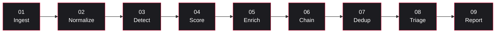
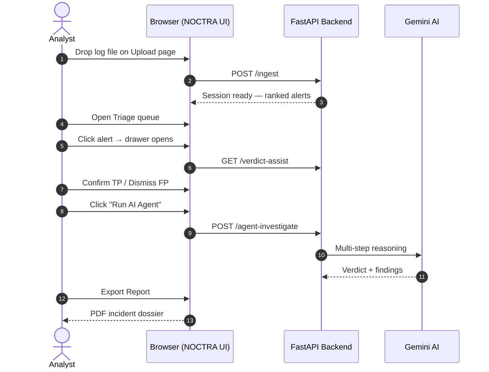
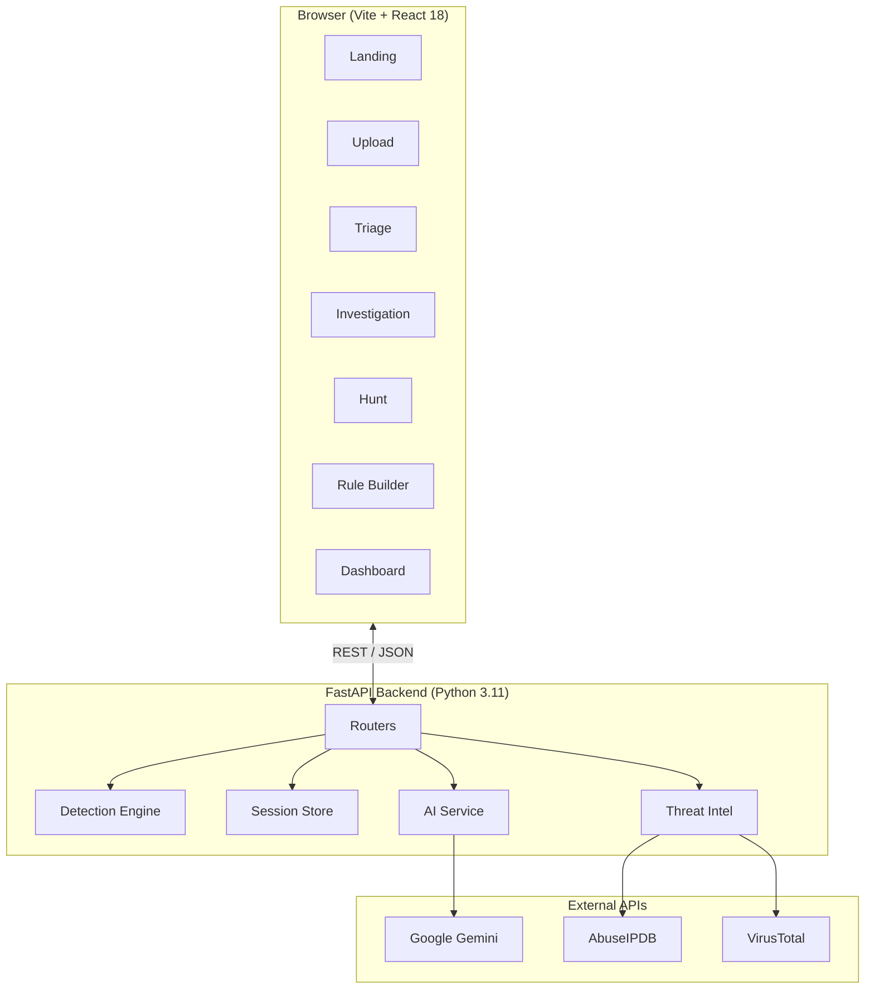

# NOCTRA AI — Autonomous SOC Platform

> **Drop a log file. Get ranked incidents, AI-explained verdicts, MITRE-mapped attack chains, and a forensic PDF report — in minutes.**

**NOCTRA AI** is an open-source, browser-based Security Operations Center powered by Google Gemini AI. It ingests raw log files (CSV, JSON, syslog, EVTX, Windows Event, Apache, logfmt), runs **42 detection rules** spanning the full MITRE ATT&CK kill-chain plus a behavioral anomaly engine (UEBA), scores every alert with an explainable AI probability, **collapses duplicate alerts before they ever reach the analyst**, maps threats to MITRE techniques, and generates forensic PDF reports — all without storing a single byte to disk. Built for SOC analysts, blue teams, and cybersecurity learners who need enterprise-grade threat detection without enterprise-grade setup time.

**Storageless · 42 rules across MITRE ATT&CK · Explainable AI · Evidence-bearing alerts · Auto-dedup · L1/L2 dual-mode · Dockerized**

[](https://noctra-ai-autonomous-soc-platform.vercel.app)
[](https://noctra-ai-autonomous-soc-platform.vercel.app)
[](https://noctra-ai-autonomous-soc-platform.onrender.com/health)
[](https://www.docker.com)
[](LICENSE)

---

## Live Demo

**[noctra-ai-autonomous-soc-platform.vercel.app](https://noctra-ai-autonomous-soc-platform.vercel.app)**

No signup required. Drop a log file or click **"Run demo scenario"** to see a synthetic multi-stage attack.

> **Note:** The backend runs on Render's free tier — the first request after inactivity may take 30–50 seconds to wake up.

---

## Table of Contents

1. [What is a SOC?](#1-what-is-a-soc-for-non-cyber-readers)
2. [What NOCTRA does](#2-what-noctra-does-in-one-paragraph)
3. [Why NOCTRA vs a normal SOC tool](#3-why-noctra-vs-a-normal-soc-tool)
4. [The 9-stage detection pipeline](#4-the-9-stage-detection-pipeline)
5. [Inside a detection rule (worked example)](#5-inside-a-detection-rule-worked-example)
6. [Anatomy of an alert](#6-anatomy-of-an-alert)
7. [The 42-rule catalogue at a glance](#7-the-42-rule-catalogue-at-a-glance)
8. [Where AI is integrated](#8-where-ai-is-integrated-5-places)
9. [How the AI attack score is calculated](#9-how-the-ai-attack-score-is-calculated)
10. [Noise reduction: how NOCTRA stops alert floods](#10-noise-reduction-how-noctra-stops-alert-floods)
11. [Walkthrough: log file → PDF report](#11-walkthrough-log-file--pdf-report)
12. [Architecture](#12-architecture)
13. [Deployment](#13-deployment)
14. [Local Development](#14-local-development)
15. [Glossary](#15-glossary-for-newcomers)
16. [FAQ](#16-faq)

---

## 1. What is a SOC? (for non-cyber readers)

A **SOC** (Security Operations Center) is the team and software inside a company that watches everything happening on the network — login attempts, file transfers, DNS queries, app errors — and tries to spot the activity that looks like an **attacker** rather than a normal user.

> Think of a SOC like a hospital triage desk, but for cyber attacks. Most patients (events) walk in with a cold (noise). A few have something serious (an attack). The SOC's job is to figure out **which is which, fast, with limited people**.

| Tier | Role | Typical question |
|------|------|------------------|
| **L1 — Triage Analyst** | First responder. Decides if an alert is real (TP) or junk (FP). | *"Is this worth waking someone up?"* |
| **L2 — Threat Analyst** | Deep investigator. Reconstructs how an attacker moved. | *"What did they touch, and how did they get in?"* |

---

## 2. What NOCTRA does, in one paragraph

NOCTRA AI is a browser-based SOC that takes a raw log file (CSV / JSON / syslog / web access / EVTX / Windows Event / Apache / logfmt), runs **42 detection rules covering brute-force → lateral movement → exfiltration → cloud-identity abuse → EDR file-drops + a behavioral anomaly engine (UEBA) + an AI classifier**, **collapses duplicates so one logical event = one alert**, and gives the analyst a **ranked queue of alerts with structured evidence and AI rationale**. The analyst clicks through, the AI suggests verdicts and explains its reasoning, the platform auto-correlates related alerts into **MITRE-mapped attack chains**, and a one-click **PDF incident report** lands at the end. Nothing is stored on disk — all data lives in RAM and is wiped when the session ends.

---

## 3. Why NOCTRA vs a normal SOC tool

| | Traditional SOC stack | **NOCTRA AI** |
|---|---|---|
| **Deployment** | Days to weeks — clusters, licenses, ingestion pipelines | **Browser tab. No install.** |
| **Cost per investigation** | $$ per GB ingested | **Free per session** |
| **AI scoring** | Usually a black-box "risk score" | **0–100 TP probability with the actual signals that produced it** |
| **Why this score?** | Rarely shown | **Click any score → list of weighted signals** |
| **MITRE ATT&CK mapping** | Add-on / paid module | **Built-in.** Every rule maps to a technique + tactic |
| **Attack-chain correlation** | Custom SPL / KQL queries | **Automatic.** Related alerts stitched into kill-chain narratives |
| **L1 vs L2 split** | Same UI for everyone | **Two purpose-built lenses** |
| **Behavioral profiling (UEBA)** | Separate product | **Built-in.** Per-user + per-IP baselines with σ-deviation |
| **Storage / compliance** | Petabytes on disk | **Zero bytes stored.** Session lives in RAM, cleared on end |

**Trade-off:** NOCTRA is built for *one log file per session* — not a full enterprise SIEM. Best for: incident response, learning the SOC analyst role, demos, blue-team exercises, post-breach triage.

---

## 4. The 9-stage detection pipeline



| # | Stage | What happens |
|---|-------|-------------|
| 01 | **Ingest** | Auto-detect format (CSV/TSV, JSON/JSONL, Apache, syslog, Windows Event, logfmt) — any other text log falls back to a generic line parser, so ingestion never fails. |
| 02 | **Normalize** | Standardise columns to a canonical schema: `timestamp, source_ip, dest_ip, dest_host, user, event_type, status, port, bytes`. Aliases cover camelCase cloud variants (`sourceIPAddress`, `eventName`, `initiatedBy.user.ipAddress`, …). Nested JSON is flattened so rules can read fields like `alert_signature_id` from a Suricata payload. |
| 03 | **Detect** | Run **42 deterministic rules** (R001–R042) + UEBA anomaly model + cross-event correlation. Rules group events by attacker context (IP, user, device) before deciding to fire — so one logical attack = one alert, not one alert per packet. |
| 04 | **Score** | AI assigns each alert a 0–1 TP probability with structured rationale + SHAP feature attribution. Heuristic fallback runs if Gemini is unavailable. |
| 05 | **Enrich** | IP reputation (AbuseIPDB / VirusTotal), geo, ASN, hash → MITRE technique. Lazy — only called when the analyst opens the alert. |
| 06 | **Chain** | Group related alerts into attack chains. Example: failed-login burst → successful login → privilege escalation → exfiltration = one kill-chain narrative. |
| 07 | **Dedup** | **Safety net.** Collapse identical alerts across rules and across repeated uploads using `(rule_id, source_ip, user, dest_ip)` keys. Summed `event_count`, earliest timestamp, highest severity, and `rolled_up_count` surfaced in `extra`. |
| 08 | **Triage** | L1 queue with drawer, playbook, AI suggestion, keyboard nav. |
| 09 | **Report** | Generate L1 shift handover or L2 forensic dossier as PDF. |

---

## 5. Inside a detection rule (worked example)

Every NOCTRA rule follows the same three-step shape: **filter → aggregate → emit**. Here's R001 — "Credential brute force":

```
filter      events where status == FAILED and source_ip is set
group by    source_ip + 60-second sliding window
threshold   ≥ 5 failed logins in the same window
emit        ONE alert per (source_ip, window)
            severity = HIGH
            mitre_technique = T1110
            evidence = list of the log indices that triggered it
```

Why this shape matters:

- **Per-row alert loops** (the anti-pattern: emit one alert per failed login) are how SOC tools generate floods. NOCTRA never iterates `for row in failed_logins:` — it always groups first.
- **Sliding time windows** rule out coincidence. 5 failed logins over 6 months is not brute force; 5 in 60 seconds is.
- **Evidence indices** let the UI jump straight to the raw log lines that produced the alert — no "trust me" black box.

Want to write your own? Use the in-app **Rule Builder** or drop a YAML rule into the DSL — same filter/group/threshold model, no Python required.

---

## 6. Anatomy of an alert

Every alert returned by `POST /ingest` is a JSON object with this shape:

```json
{
  "alert_id": "a-7f3c12",
  "rule_id": "R001",
  "rule_name": "Credential Brute Force",
  "severity": "HIGH",
  "tp_probability": 0.92,
  "description": "8 failed logins from 203.0.113.66 in a 60-second window — credential compromise: SUCCEEDED",
  "timestamp": "2026-05-25T02:31:14Z",
  "source_ip": "203.0.113.66",
  "user": "jdoe",
  "event_count": 8,
  "mitre_technique": "T1110",
  "mitre_tactic": "Credential Access",
  "related_log_indices": [12, 13, 15, 17, 19, 21, 22, 24],
  "extra": {
    "window_seconds": 60,
    "succeeded_after": true,
    "rolled_up_count": 1
  },
  "ai_rationale": "Burst of failed logins followed by success from same IP is a classic brute-force pattern.",
  "shap_features": [
    {"feature": "failed_login_count", "contribution": 0.41},
    {"feature": "success_after_failures", "contribution": 0.28},
    {"feature": "source_ip_reputation", "contribution": 0.13}
  ]
}
```

| Field | What it tells the analyst |
|-------|---------------------------|
| `tp_probability` | "How likely is this real?" — 0–1, blended from heuristic + Gemini. |
| `event_count` | How many raw log events were folded into this one alert. |
| `related_log_indices` | The exact rows of the source log that triggered this rule — click in the UI to jump to them. |
| `mitre_technique` / `mitre_tactic` | What attacker behaviour this is, in industry-standard ATT&CK vocabulary. |
| `extra.rolled_up_count` | If > 1, this alert is the merge of N near-identical alerts (dedup stage). |
| `shap_features` | Top signals the AI used to score this alert. Removes "black box" doubt. |
| `ai_rationale` | One-sentence English explanation tailored to this specific alert. |

---

## 7. The 42-rule catalogue at a glance

| Family | Rule IDs | Examples | MITRE tactic |
|--------|----------|----------|--------------|
| **Credential & Identity** | R001–R003, R006, R007, R020 | Brute force, port scan, privilege escalation, off-hours login, new admin account, RDP brute | Credential Access, Reconnaissance |
| **Lateral movement & Recon** | R004, R008, R022 | Multi-host auth, web fuzzing (404 burst), impossible travel | Lateral Movement, Discovery |
| **Exfiltration & C2** | R005, R012–R015, R024 | Large outbound transfer, DNS tunnelling, beaconing, suspicious User-Agent | Exfiltration, Command & Control |
| **Web & App attacks** | R010, R016–R019 | Multi-service attack, SQLi, XSS, Log4Shell, path traversal | Initial Access, Execution |
| **Endpoint & EDR** | R011, R025, R031, R032 | Suspicious PowerShell, AMSI bypass, masquerading binary, scripting drops EXE | Execution, Defense Evasion |
| **IDS / Network** | R023, R026, R027 | Suricata signature hit, port-knocking, internal IP scan | Discovery, Initial Access |
| **Email & Phishing** | R028, R029 | Suspicious email auth fail, phishing with risky attachment | Initial Access |
| **Cloud Identity (AWS / Entra / M365)** | R030, R034–R042 | Cloud admin grant, console root login, AWS API without MFA, CloudTrail tampering, OAuth consent grant, Kerberoasting | Persistence, Defense Evasion |
| **Behavioral (UEBA)** | `UEBA-*` | IsolationForest anomaly per user/IP | Multiple |

---

## 8. Where AI is integrated (5 places)

| # | Where | What the AI does | Fallback if unavailable |
|---|-------|------------------|------------------------|
| 1 | **Detect** | IsolationForest UEBA model scores each user/IP for deviation from baseline | Deterministic threshold rules |
| 2 | **Score** | Gemini classifier returns a 0–1 TP probability + rationale per alert | 10-signal heuristic scorer |
| 3 | **Triage** | AI generates alert-specific TP/FP reasons + tailored response playbook | Static reason library |
| 4 | **Investigate** | Autonomous agent produces verdict recommendation, key findings, reasoning steps | Manual investigation tabs |
| 5 | **Chain** | LLM writes a plain-English kill-chain narrative | Structured chain summary |

---

## 9. How the AI attack score is calculated

Every alert receives a **0–100 TP probability**.

| Signal | Weight |
|--------|-------:|
| Severity = `CRITICAL` | +25 |
| Severity = `HIGH` | +15 |
| Deterministic rule match | +10 |
| UEBA baseline deviation (>2σ) | +18 |
| Cross-event correlation hit | +12 |
| ≥ 2 MITRE techniques chained | +15 |
| Single MITRE technique mapped | +5 |
| IsolationForest anomaly > 0.6 | +10 |
| ≥ 5 correlated events on the same alert | +8 |

These are summed, clamped to 0–100, then blended with the Gemini classifier (70% AI / 30% heuristic when available).

| Score | Tier |
|------:|------|
| ≥ 75% | **HIGH CONFIDENCE TP** |
| 45–74% | **LIKELY TP** |
| < 45% | **LOW CONFIDENCE** |

---

## 10. Noise reduction: how NOCTRA stops alert floods

The #1 reason SOC analysts ignore their tools is **alert fatigue** — when one logical attack produces 100 alerts and the real signal drowns in repetition. NOCTRA fights this in four layers:

### Layer 1 — Rules aggregate before they emit
Every rule groups its matching events by attacker context (`source_ip`, `user`, `device`, `sender`) and emits **one alert per group**, not one per row. A ransomware run that drops 200 files = **1** alert with `event_count: 200` and a sample of filenames in `extra`.

### Layer 2 — Sliding time windows
Volume-based rules (R001 brute force, R002 port scan, R008 fuzzing) require the threshold be hit **inside a narrow window** (60s, 30s, 5min). 20 HTTP 404s spread across a week is normal browsing noise; 20 in five minutes is fuzzing. This single check kills most "log file spans 7 days" false positives.

### Layer 3 — Pipeline-wide dedup pass
After all rules run, the ingest pipeline does one final sweep. Any alerts sharing `(rule_id, source_ip, user, dest_ip)` get merged into the earliest one — keeping the higher severity, the higher confidence, and recording `rolled_up_count` so the UI can show "5 duplicates suppressed". This catches anything the per-rule aggregation missed and prevents repeated uploads of the same activity from compounding.

### Layer 4 — Parser robustness ensures rules actually fire
The other half of "too many alerts" is "wrong alerts because fields were misparsed". NOCTRA's parser:
- Re-runs the status heuristic when the column is present-but-empty (a common CSV quirk where `keep_default_na=False` makes empty cells look populated).
- Carries 40+ field aliases per canonical name — `sourceIPAddress`, `source_ip`, `srcip`, `ClientIp`, `remote_addr`, `caller_ip_address`, `initiatedBy.user.ipAddress` all collapse to `source_ip`.
- Flattens nested JSON so Suricata `alert.signature.id` and AWS `userIdentity.arn` end up as flat columns rules can read.
- Normalises every empty/`"none"`/`"null"` string to Python `None` so `.notna()` checks behave consistently across cloud schemas.

**Net effect:** a real attack fires the expected handful of distinct alerts. A clean log fires nothing. Repeated uploads don't multiply.

---

## 11. Walkthrough: log file → PDF report



---

## 12. Architecture



---

## 13. Deployment

| Layer | Platform | URL |
|-------|----------|-----|
| **Frontend** | Vercel | [noctra-ai-autonomous-soc-platform.vercel.app](https://noctra-ai-autonomous-soc-platform.vercel.app) |
| **Backend** | Render | `https://noctra-ai-autonomous-soc-platform.onrender.com` |

### Vercel — Frontend

| Setting | Value |
|---------|-------|
| Root Directory | `frontend` |
| Build Command | `npm run build` |
| Output Directory | `dist` |
| Install Command | `npm install` |

**Environment variables (Vercel):**

| Key | Value |
|-----|-------|
| `VITE_API_URL` | Your Render backend URL |

### Render — Backend

| Setting | Value |
|---------|-------|
| Root Directory | `backend` |
| Runtime | Python 3 |
| Build Command | `pip install -r requirements.txt` |
| Start Command | `uvicorn main:app --host 0.0.0.0 --port $PORT` |

**Environment variables (Render):**

| Key | Description |
|-----|-------------|
| `GEMINI_API_KEY` | Google AI Studio key |
| `ABUSEIPDB_API_KEY` | AbuseIPDB key |
| `VIRUSTOTAL_API_KEY` | VirusTotal key |
| `CORS_ORIGIN` | Your Vercel frontend URL |
| `SESSION_TTL_MINUTES` | `30` |
| `MAX_UPLOAD_MB` | `25` |

---

## 14. Local Development

### Option A — Docker (recommended)

```bash
# Copy and fill in your API keys
cp backend/.env.example backend/.env

# Start both services
docker compose up --build
```

Frontend: [http://localhost:3000](http://localhost:3000) · Backend: [http://localhost:8000](http://localhost:8000)

### Option B — Manual

See [SETUP.txt](SETUP.txt) for full manual setup instructions.

```bash
# Backend
cd backend
python -m venv venv && source venv/bin/activate  # Windows: venv\Scripts\activate
pip install -r requirements.txt
cp .env.example .env
uvicorn main:app --reload --port 8000

# Frontend (new terminal)
cd frontend
npm install
npm run dev
```

Open [http://localhost:5173](http://localhost:5173).

### Option C — Self-hosted Production (Docker)

```bash
cp .env.example .env.prod
# Fill in .env.prod with real API keys and URLs
docker compose --env-file .env.prod -f docker-compose.prod.yml up -d
```

---

## 15. Glossary for newcomers

| Term | Meaning |
|------|---------|
| **Alert** | The platform flagging "this looks suspicious." A grouped event, not a single log line. |
| **TP / FP** | True Positive (real attack) / False Positive (noise). |
| **Triage** | Quickly sorting alerts into TP vs FP. |
| **MITRE ATT&CK** | Industry catalogue of attacker techniques. Every NOCTRA rule maps to one. |
| **Technique vs Tactic** | A *tactic* is the attacker's goal ("Credential Access"); a *technique* is how they do it ("T1110 – Brute Force"). |
| **UEBA** | User & Entity Behavior Analytics — flags deviations from baseline using IsolationForest. |
| **Attack chain** | A sequence of related alerts that together describe one attack story (e.g. brute-force → escalation → exfil). |
| **Kill chain** | Conceptual model of an attack's stages: recon → weaponise → deliver → exploit → install → C2 → actions on objectives. |
| **IOC** | Indicator of Compromise — an IP, domain, hash, or user seen in an attack. |
| **SHAP** | Technique that explains which features most affected an ML model's score. |
| **L1 / L2** | Tier-1 (triage & respond) / Tier-2 (hunt & correlate). |
| **Sliding window** | A time range that moves with the events — "5 failed logins in any 60-second span" rather than "in the last fixed minute". |
| **Aggregation** | Collapsing many matching events into one alert with a count, instead of one alert per event. |
| **Dedup / collapse** | Pipeline-wide pass that merges alerts sharing rule + actor + target. Stops floods. |
| **Evidence** | The exact log-row indices that triggered a rule — lets the analyst verify, not just trust. |
| **Field alias** | Many log sources call the same thing different names (`source_ip` vs `sourceIPAddress` vs `client_ip`). Aliases collapse them to one canonical name. |
| **Storageless** | Nothing persists to disk. Session lives only in server RAM and is wiped after 30 min idle. |

---

## 16. FAQ

**Q. Does NOCTRA replace Splunk / Sentinel?**  
No. NOCTRA is for one log file per session — incident response, learning, demos, post-breach triage. Use a full SIEM for continuous enterprise monitoring.

**Q. Does the AI send my raw logs to Google?**  
No. Only the alert envelope (rule name, MITRE tag, timestamps) is sent to Gemini. Raw log lines stay in your backend RAM.

**Q. What if Gemini is down or I have no API key?**  
Everything still works. The platform falls back to a 10-signal deterministic scorer.

**Q. How is "storageless" enforced?**  
Sessions live in a Python dict in process memory. A janitor task evicts them after 30 minutes of inactivity. No DB, no disk write.

**Q. Can I add my own rules?**  
Yes — the Rule Builder ships with four templates. Compose multi-condition filters, assign severity, map a MITRE technique, and test-fire against the active session.

**Q. I uploaded the same log twice and got the same alerts twice. Is that a bug?**  
No — each upload creates an independent session. Within a single session, NOCTRA dedups aggressively (Layer 3 above). Across sessions, history is intentionally isolated so demos and investigations don't bleed into each other.

**Q. A rule didn't fire on a log I expected to trigger it. What do I check?**  
Three things, in order: (1) Did the parser map your column names correctly? Open the session detail page — if `source_ip` shows empty rows it means your log used a name not yet aliased. (2) Did the rule's threshold/window actually match? Volume rules need the burst inside their window. (3) Did the dedup pass collapse it into another alert? Look for `extra.rolled_up_count > 1` on a neighbouring alert.

**Q. Why "42 rules"? Will there be more?**  
42 is the current coverage across the MITRE ATT&CK matrix from credential access through cloud persistence and EDR detections (R001–R042). New rules are added as gaps surface in real-world testing — the framework is designed so adding a rule is a single function in [`engine/rules.py`](backend/engine/rules.py).

**Q. How does NOCTRA tell aggregation from suppression?**  
Aggregation happens *inside* a rule (group rows that match one rule together). Dedup happens *across* rules at the pipeline end (merge alerts that point at the same actor+target). Both preserve `event_count` so nothing is "lost" — only the per-row noise is.

**Q. What log formats actually work today?**  
CSV / TSV (any delimiter, mixed case headers OK), JSON / JSONL / NDJSON (nested objects auto-flattened), Apache combined / common, syslog (RFC 3164 + 5424), Windows Event Log text export, logfmt key=value, generic free-text (line per event). Cloud-specific: AWS CloudTrail JSON, Entra Sign-In + Audit logs, M365 Unified Audit, Defender for Endpoint exports, Suricata EVE JSON.

---

<p align="center"><sub><b>NOCTRA AI</b> · Autonomous SOC · v3.1 · 42 rules · Auto-dedup · Storageless by design · MIT License</sub></p>
