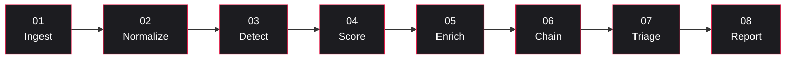
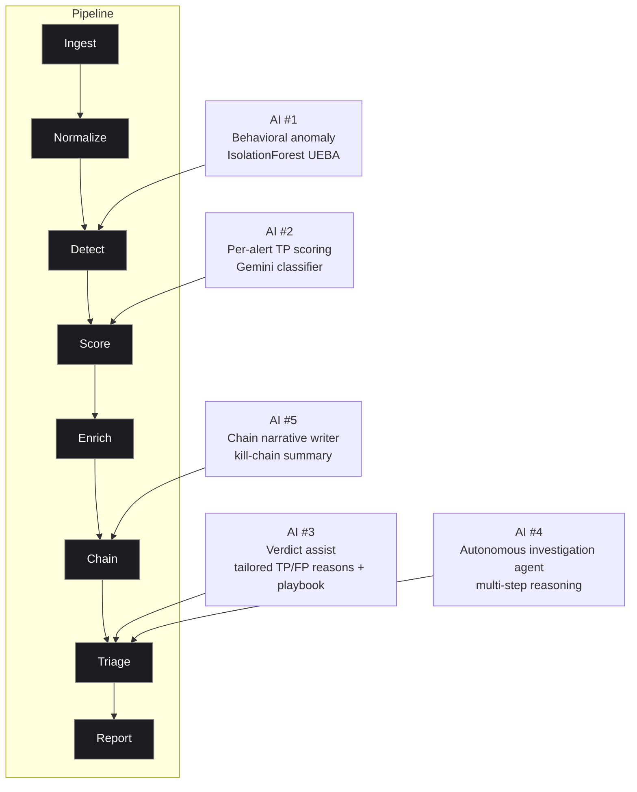
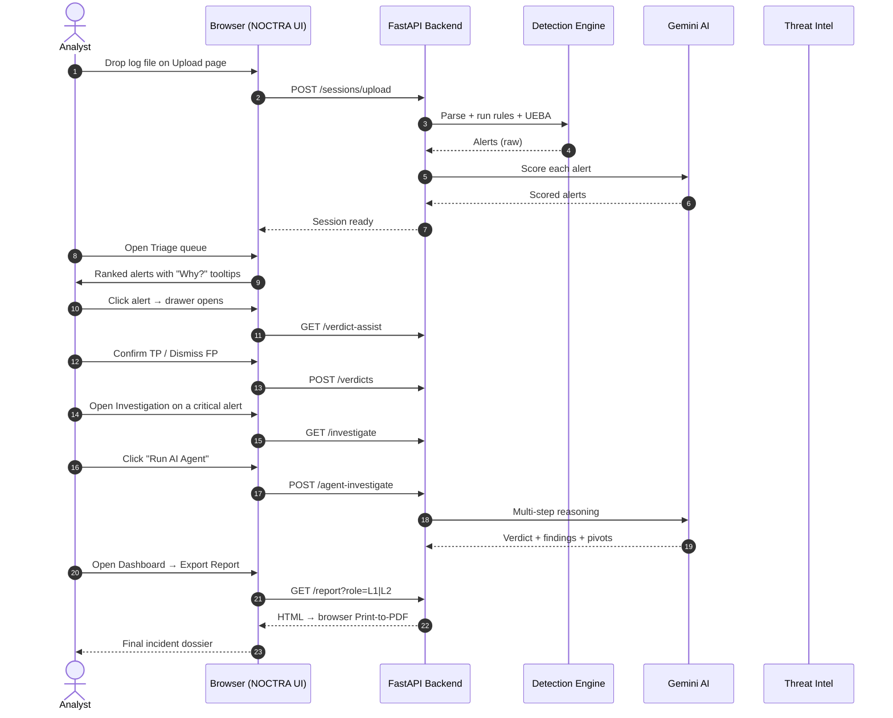
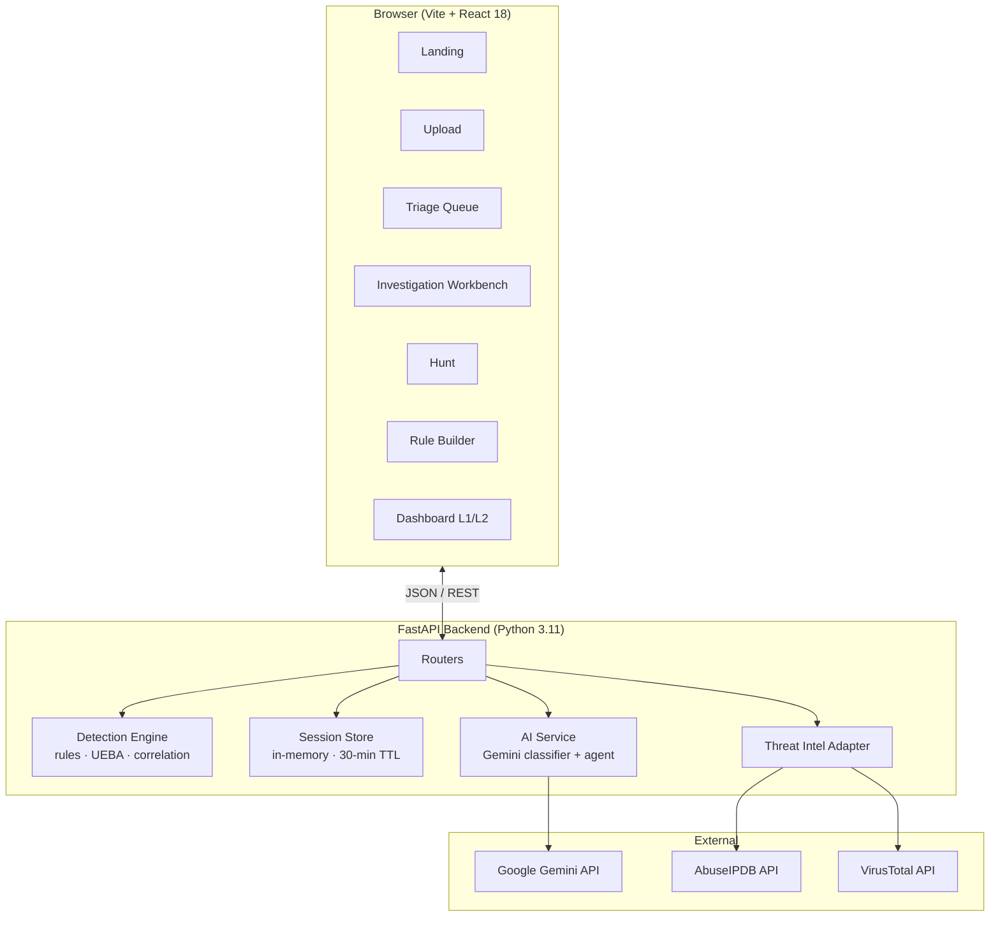

# NOCTRA AI — Autonomous SOC Platform

> **Drop a log file. Get ranked incidents, AI-explained verdicts, MITRE-mapped attack chains, and a forensic PDF report — in minutes.**

An AI-augmented Security Operations Center in a browser tab.
**Storageless · MITRE ATT&CK-mapped · Explainable AI · L1/L2 dual-mode**

> **Live demo:** [noctra-ai-autonomous-soc-platform.vercel.app](https://noctra-ai-autonomous-soc-platform.vercel.app)
> **Want to run it locally?** See `SETUP.txt`.
> **This file** explains what it is, how it works, and why it matters.

---

## Deployment

| Layer | Platform | Notes |
|-------|----------|-------|
| **Frontend** | [Vercel](https://vercel.com) | Auto-deploys from `main` branch · Root dir: `frontend` · Build: `npm run build` · Output: `dist` |
| **Backend** | Self-hosted / separate service | FastAPI — deploy to Railway, Render, or any Python host. Set `VITE_API_URL` in Vercel env vars to point to it. |

### Environment variables (Vercel → Project Settings → Environment Variables)

| Key | Value |
|-----|-------|
| `VITE_API_URL` | Your deployed FastAPI backend URL (e.g. `https://noctra-api.onrender.com`) |
| `VITE_APP_NAME` | `NOCTRA-SOC` |

> The frontend falls back to `/api` (local dev proxy) if `VITE_API_URL` is not set.

---

## Table of contents

1. [What is a SOC? (for non-cyber readers)](#1-what-is-a-soc-for-non-cyber-readers)
2. [What NOCTRA does, in one paragraph](#2-what-noctra-does-in-one-paragraph)
3. [Why NOCTRA vs. a "normal" SOC tool](#3-why-noctra-vs-a-normal-soc-tool)
4. [The 8-stage detection pipeline](#4-the-8-stage-detection-pipeline)
5. [Where AI is integrated (5 places)](#5-where-ai-is-integrated-5-places)
6. [How the AI attack score is calculated](#6-how-the-ai-attack-score-is-calculated)
7. [Walkthrough: log file → PDF report](#7-walkthrough-log-file--pdf-report)
8. [Architecture](#8-architecture)
9. [Glossary for newcomers](#9-glossary-for-newcomers)
10. [FAQ](#10-faq)

---

## 1. What is a SOC? (for non-cyber readers)

A **SOC** (Security Operations Center) is the team and software inside a company that watches everything happening on the network — login attempts, file transfers, DNS queries, app errors — and tries to spot the activity that looks like an **attacker** rather than a normal user.

> Think of a SOC like a hospital triage desk, but for cyber attacks. Most patients (events) walk in with a cold (noise). A few have something serious (an attack). The SOC's job is to figure out **which is which, fast, with limited people**.

A SOC runs in two main shifts:

| Tier | Role | Typical question |
|------|------|------------------|
| **L1 — Triage Analyst** | First responder. Decides if an alert is real (TP) or junk (FP). | *"Is this worth waking someone up?"* |
| **L2 — Threat Analyst** | Deep investigator. Reconstructs how an attacker moved. | *"What did they touch, and how did they get in?"* |

Both shifts drown in alerts. A mid-size company can see **10,000+ alerts a day** — and historically ~95% are false alarms. The hard problem isn't *finding* alerts; it's **finding the real ones in time**.

---

## 2. What NOCTRA does, in one paragraph

NOCTRA AI is a browser-based SOC that takes a raw log file (CSV / JSON / syslog / web access / EVTX), runs **25+ detection rules + a behavioral anomaly engine + an AI classifier** against it, and gives the analyst a **ranked queue of alerts with explanations**. The analyst clicks through, the AI suggests verdicts and explains its reasoning, the platform auto-correlates related alerts into **attack chains**, and a one-click **PDF incident report** lands at the end. Nothing is stored on disk — all data lives in RAM and is wiped when the session ends.

---

## 3. Why NOCTRA vs. a "normal" SOC tool

Traditional SOC platforms (Splunk, ELK, Sentinel, QRadar) are powerful but built for large enterprise teams with months to set up. Here's what NOCTRA does differently:

| | Traditional SOC stack | **NOCTRA AI** |
|---|---|---|
| **Deployment** | Days to weeks — clusters, licenses, ingestion pipelines | **Browser tab. No install.** |
| **Cost per investigation** | $$ per GB ingested | **Free per session** — log file never leaves the analyst's machine longer than the session |
| **AI scoring** | Usually a black-box "risk score" | **0–100 TP probability with the actual signals that produced it** |
| **Why this score?** | Rarely shown | **Click any score → list of weighted signals.** No black box. |
| **MITRE ATT&CK mapping** | Add-on / paid module | **Built-in.** Every rule maps to a technique + tactic; dashboard shows coverage matrix and gap analysis |
| **Attack-chain correlation** | Custom SPL / KQL queries | **Automatic.** Related alerts stitched into kill-chain narratives |
| **L1 vs L2 split** | Same UI for everyone | **Two purpose-built lenses**: L1 = shift-work queue · L2 = forensic workbench |
| **Behavioral profiling (UEBA)** | Separate product | **Built-in.** Per-user + per-IP baselines with σ-deviation and peer comparison |
| **Storage / compliance** | Petabytes on disk | **Zero bytes stored.** Session lives in RAM, cleared on end |
| **Learning from analyst feedback** | Manual rule tuning | **Real-time online weighting.** Every TP/FP verdict nudges ranking for the rest of the session |

**The trade-off:** NOCTRA is built for *one log file per session* — it's not a full enterprise SIEM. It's the **right tool for**: incident response on a single capture, learning the SOC analyst role, demos, blue-team exercises, post-breach triage of an exported dataset.

---

## 4. The 8-stage detection pipeline

Every log file flows through this pipeline. Hover any stage in the UI to see its description.



| # | Stage | What happens | Why it matters |
|---|-------|-------------|----------------|
| 01 | **Ingest** | Auto-detect format (CSV/JSON/syslog/EVTX/web access). Parse into rows. | Analyst doesn't have to write a parser. |
| 02 | **Normalize** | Standardise columns: `ts, ip, user, action, status, port`. | Detection rules become format-agnostic. |
| 03 | **Detect** | Run 25+ rules + UEBA anomaly model + cross-event correlation. | Catches both known patterns *and* never-seen-before anomalies. |
| 04 | **Score** | AI assigns each alert a 0–1 TP probability with rationale + SHAP feature attribution. | Analyst sees *which signals* drove the score. |
| 05 | **Enrich** | IP reputation (AbuseIPDB / VirusTotal), geo, ASN, hash → MITRE technique. | Adds the context a human would otherwise google. |
| 06 | **Chain** | Group related alerts sharing entities (IP, user, host) into attack chains. | Surfaces multi-stage attacks the rules see as separate events. |
| 07 | **Triage** | L1 queue with drawer, playbook, AI suggestion, keyboard nav. | One analyst can clear 100 alerts/hour with traceable verdicts. |
| 08 | **Report** | Generate L1 shift handover *or* L2 forensic dossier as a PDF. | Executive- and handover-ready output without copy-paste. |

---

## 5. Where AI is integrated (5 places)

NOCTRA isn't "AI bolted on." AI is wired into five distinct stages — each with a deterministic fallback so the platform still works if the AI is unavailable.



| # | Where | What the AI does | Fallback if AI is unavailable |
|---|-------|------------------|------------------------------|
| 1 | **Detect** | IsolationForest UEBA model scores each user/IP for deviation from baseline | Deterministic threshold rules still fire |
| 2 | **Score** | Gemini-backed classifier returns a 0–1 TP probability + rationale per alert | 10-signal heuristic scorer (rule, MITRE, severity, repeat-source, off-hours, etc.) |
| 3 | **Triage** | AI generates alert-specific TP/FP reasons + a tailored response playbook on drawer open | Static reason library + generic playbook |
| 4 | **Investigate** | Autonomous agent reads timeline + IOCs + UEBA + chains → produces verdict recommendation, key findings, reasoning steps, suggested pivots | Manual investigation tabs still available |
| 5 | **Chain** | LLM writes a plain-English kill-chain narrative from the chained alerts | Structured but unstyled chain summary |

> **Trust principle:** every AI output in NOCTRA can be challenged. Click "Why?" on a score, hover an anomaly bar, expand a verdict reason — the platform shows the underlying signals so the analyst can verify, not just trust.

---

## 6. How the AI attack score is calculated

Every alert receives a **0–100 TP probability**. Click the score in the UI (or hover the percent in the Triage queue) to see exactly which signals contributed.

### 6.1 The signals (each adds weight)

| Signal | Weight | Source |
|--------|-------:|--------|
| Severity = `CRITICAL` | +25 | Rule that fired |
| Severity = `HIGH` | +15 | Rule that fired |
| Deterministic rule match | +10 | Detection engine |
| UEBA baseline deviation (>2σ) | +18 | Behavioral profile model |
| Cross-event correlation hit | +12 | Pattern correlator |
| ≥ 2 MITRE techniques chained | +15 | MITRE tagging + chain engine |
| Single MITRE technique mapped | +5 | MITRE tagging |
| IsolationForest anomaly > 0.6 | +10 | UEBA anomaly model |
| ≥ 5 correlated events on the same alert | +8 | Correlation engine |
| AI rationale (Gemini) | qualitative | LLM analysis |

These are summed, clamped to 0–100, and re-scored by the Gemini classifier against MITRE context. The final number is the **composite**.

### 6.2 The math, in pseudocode

```python
def composite_score(alert) -> float:
    base = 0
    base += {"CRITICAL": 25, "HIGH": 15, "MEDIUM": 5}.get(alert.severity, 0)
    if "rule_based"          in alert.methods: base += 10
    if "behavioral_anomaly"  in alert.methods: base += 18
    if "pattern_correlation" in alert.methods: base += 12
    if len(alert.mitre_techniques) > 1: base += 15
    elif alert.mitre_techniques:        base += 5
    if alert.anomaly_score and alert.anomaly_score > 0.6: base += 10
    if alert.event_count and alert.event_count > 5:        base += 8

    ai_prob = gemini_classifier(alert)          # 0–1, or None if unavailable
    if ai_prob is not None:
        # 70% AI when available, 30% heuristic
        return 0.7 * ai_prob + 0.3 * (base / 100)
    return base / 100                            # fallback to heuristic only
```

### 6.3 What the analyst sees

| Score | Tier | Meaning |
|------:|------|---------|
| ≥ 75% | **HIGH CONFIDENCE TP** | The AI is confident this is a real incident. Bulk-apply is safe. |
| 45–74% | **LIKELY TP** | Plausible, but verify before bulk-applying. |
| < 45% | **LOW CONFIDENCE** | Could go either way — analyst judgement required. |

Every score has a **"Why?"** button or tooltip listing the weighted signals that produced it. No black box.

---

## 7. Walkthrough: log file → PDF report



---

## 8. Architecture



### Module layout

```
SOC Project/
├── frontend/                  # React UI (Vite + Tailwind)
│   └── src/
│       ├── pages/             # Landing, Upload, Triage, Investigation, Hunt, RuleBuilder, Dashboard
│       ├── components/        # Layout, AIAgentPanel, BehaviorProfile, GraphView, ShapChart, …
│       └── utils/             # Report builder
└── backend/                   # FastAPI service (Python 3.11)
    ├── main.py                # App bootstrap
    ├── routers/               # sessions, triage, investigate, hunt, rules, dashboard
    ├── engine/                # rules, ueba, correlation, chains, scoring, ai_client
    ├── session/               # in-memory store + TTL janitor
    └── schemas/               # Pydantic v2 models
```

---

## 9. Glossary for newcomers

| Term | Plain-English meaning |
|------|-----------------------|
| **Alert** | The platform flagging "this looks suspicious." |
| **TP / FP** | True Positive (real attack) / False Positive (noise). The two verdict options. |
| **Triage** | Quickly sorting alerts into TP vs FP — the L1 analyst's main job. |
| **MITRE ATT&CK** | Industry catalogue of how attackers behave, organised into **tactics** (the goal — e.g. *Lateral Movement*) and **techniques** (the how — e.g. *T1021.001 RDP*). |
| **UEBA** | User & Entity Behavior Analytics — math that learns "normal" for each user/IP, then flags deviations. |
| **Attack chain / kill chain** | A sequence of related alerts that together describe one attack story (brute-force → success → lateral move → exfiltration). |
| **IOC** | Indicator of Compromise — an artefact (IP, domain, hash, user) seen in an attack that other defenders can hunt for. |
| **Playbook** | Pre-written checklist of response steps for a rule (e.g. "R001 Brute Force → block IP, force MFA, rotate password"). |
| **SHAP** | Technique that explains *which features* most affected an ML model's score. |
| **L1 / L2** | Tier-1 (triage & respond) / Tier-2 (hunt & correlate). |
| **Storageless** | Nothing persists to disk. Session lives only in server RAM. |

---

## 10. FAQ

**Q. Does NOCTRA replace Splunk / Sentinel?**
No. NOCTRA is for **one log file per session** — incident response, learning, demos, post-breach triage. Use a full SIEM for continuous enterprise monitoring.

**Q. Does the AI ever send my raw logs to Google?**
No. Only the **alert envelope** (rule name, MITRE tag, timestamps, anonymisable IP/user) is sent to Gemini. Raw log lines stay in your backend RAM.

**Q. What if Gemini is down or I have no API key?**
Everything still works. The platform falls back to a **10-signal deterministic scorer** that produces and explains the same 0–100 number.

**Q. How is "storageless" enforced?**
Sessions live in a Python dict in process memory. A janitor task evicts them after 30 minutes of inactivity, and the "Clear session" button wipes immediately. No DB, no disk write.

**Q. Can I add my own rules?**
Yes — the **Rule Builder** module ships with four templates (brute force, lateral, exfil, priv-esc). Compose multi-condition filters, assign severity, map a MITRE technique, and test-fire against the active session before committing.

**Q. Where do I see *why* an AI score is what it is?**
Hover the percent in the Triage queue, or click **"Why?"** on the Investigation confidence card. You'll get the weighted-signal breakdown described in [§6](#6-how-the-ai-attack-score-is-calculated).

---

<p align="center"><sub><b>NOCTRA AI</b> · Autonomous SOC · v3.0 · Storageless by design<br/>
For setup, see <a href="SETUP.txt">SETUP.txt</a></sub></p>
